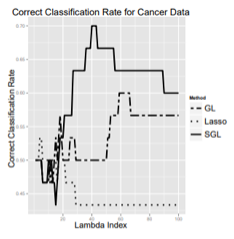

The following page showcases some of my projects in the field of AI and ML.

  

    
    

      
Variational Amodal Object Completion for Interactive Scene Editing

      
Huan Ling, David Acuna, Karsten Kreis, Seung Kim, Sanja Fidler

      
In NeurIPS, Vancouver, 2020

      

        <a class="paper" href="#">Paper</a>
        <a class="abstract" href="#">Abstract</a>
        <a class="project-page" href="#">Project page</a>
        <a class="bibtex" href="#">Bibtex</a>
      

    

  

  

    
    

      
Federated Simulation for Medical Imaging (nominated for Young Scientist Award)

      
Daiqing Li, Amlan Kar, Nishant Ravikumar, Alejandro F Frangi, Sanja Fidler

      
In MICCAI, 2020

      

        <a class="paper" href="#">Paper</a>
        <a class="abstract" href="#">Abstract</a>
        <a class="project-page" href="#">Project page</a>
        <a class="bibtex" href="#">Bibtex</a>
      

    

  

  

    
    

      
Baysian Non-Parametric Estimation to Entropy and Extropy based on Right Censored Data

      
Luai Al Labadi, Tahir Muhammad

      
In Monte Carlo Methods and Applications, 2022

      

        <a class="paper" href="https://www.degruyter.com/document/doi/10.1515/mcma-2022-2123/html?lang=en">Paper</a>
        <a class="abstract" href="#">Code</a>
        <a class="project-page" href="#">Presentation</a>
      

    

  

  

    
    

      
Sparse Group Lasso Paper Review & Implementation

      
Tahir Muhammad

      
Best Paper Award from all Statistical Learning II students (Recieved 98%)

      

        <a class="paper" href="https://drive.google.com/file/d/1mbH0SWPg9T1fQf9CLOnZP9zLOF6jSFdx/view?usp=sharing"> Paper</a>
        <a class="abstract" href="https://github.com/Tahir001/R/blob/master/Solutions/SparseGroupLasso.R"> Code</a>
        <a class="project-page" href="https://docs.google.com/presentation/d/10pM19yjenCYsvZOFWCuAXsoiftGot3lFHjQvUJ7hheM/edit?usp=sharing"> Presentation</a>
      

    

  

  

    
    

      
Resampling Methods

      
Tahir Muhammad, Saurabh Sant

      

      

        <a class="paper" href="https://drive.google.com/file/d/1re5TodDTUuheRbXfwoVEZaMLI1P16n2O/view?usp=sharing"> Paper</a>
        <a class="abstract" href="https://github.com/Tahir001/R/blob/master/Solutions/Re-SamplingMethods.R"> Code</a>
        <a class="project-page" href="#"> Presentation</a>
      

    

  

## AI Conferences

Some of the AI conferences I had the pleasure to attend:[AI Conferences Notes](https://tahir001.github.io/website//AInotes/AIConferences)